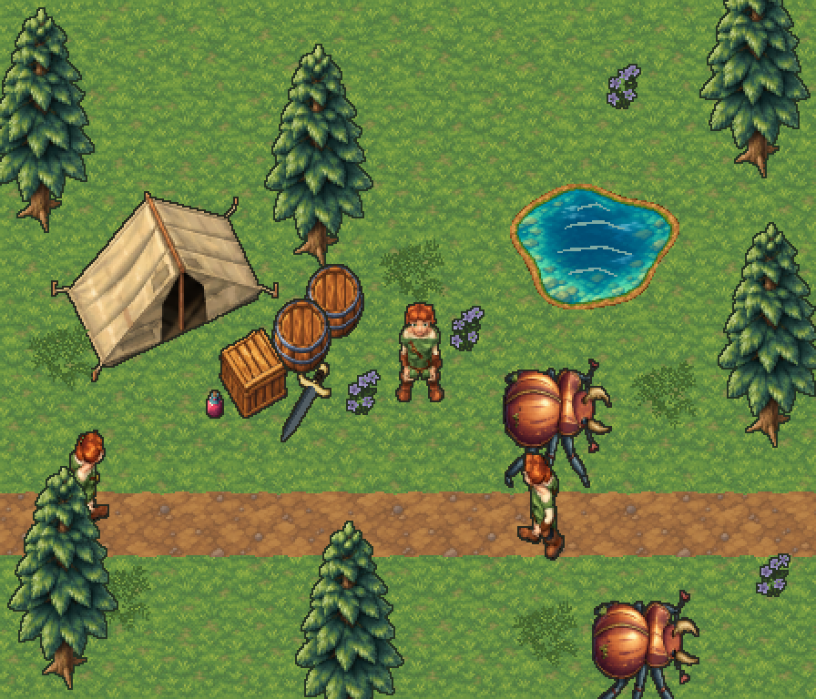
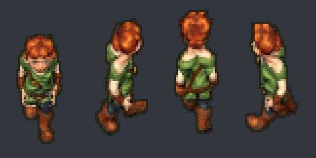

# Spriteforge

Create editable Blender models and export full-RGB RPG sprites, directional
atlases and stepped animation.

```sh
npx skills add luan/spriteforge
```

Ask an agent to use `$spriteforge` with a description or concept, native asset
size, directions and animations. Requires `uv` and Blender 5.2+; FFmpeg is
optional for MP4 recordings.



[Full 24-second recording](examples/forest-camp/media/scene.mp4)
· [Models, sprite sheets and replay instructions](examples/forest-camp/README.md)



The scene combines 19 independent assets: terrain, water, vegetation, characters,
creatures, props and items. Blender determines the geometry and poses; optional
imagegen edits paint each entity's sheet. Colors are unrestricted.

[Skill workflow](skills/spriteforge/SKILL.md)
· [Render settings](skills/spriteforge/references/workflow.md)
· [Animation library and attribution](skills/spriteforge/references/animation.md)
